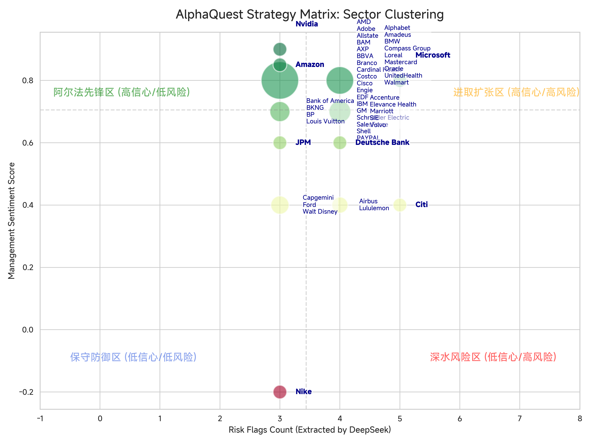
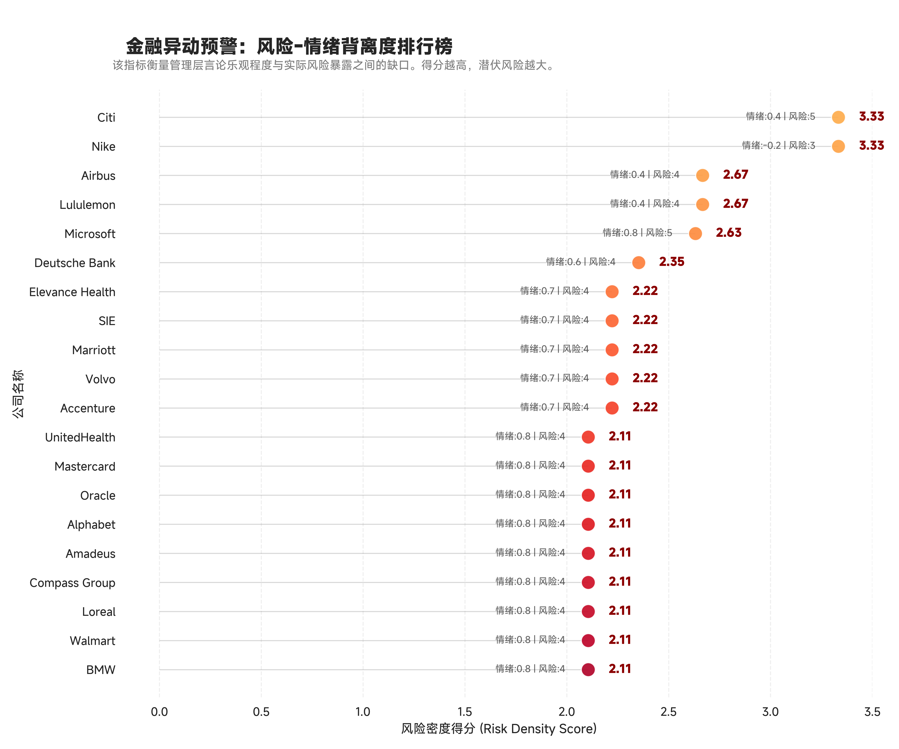

# 🚀 AlphaQuest: LLM 驱动的金融情报透视引擎

**AlphaQuest** 是一款工业级金融情报自动化系统。它利用 **DeepSeek-V3** 的深度语义理解能力，配合高并发工程管线，实现了对全球顶级巨头财报通话记录（Earnings Call Transcripts）的结构化解析、风险对齐与自动化投研点评。






### 📊 核心效能看板 (Performance Dashboard)

| 指标 | 表现 |
| --- | --- |
| **处理成本** | **￥0.64 RMB** (总计) / **￥0.012** (单家) |
| **处理规模** | 全球 50+ 行业巨头 (Tech, Industrials, Finance) |
| **吞吐效率** | ~120s 完成 120万 Token 深度解析 (8线程并行) |
| **自动化价值** | 替代资深分析师约 **40+ 小时** 的数据清洗工作 |
| **技术架构** | DeepSeek-V3 + ThreadPoolExecutor + MiSans Viz Engine |

---

## 🛠️ 五大核心模块说明

### 1. 高性能并行提取工厂 (Module 1)

针对长文本挑战，本项目放弃了昂贵的“全量 Embedding”，采用了 **非均匀头尾采样策略 (Head-Tail Sampling)**：

* **算法设计**：精准提取 `Head(8k)` 管理层陈述与 `Tail(12k)` Q&A 激烈博弈。
* **并行优势**：通过 `ThreadPoolExecutor` 掩盖 I/O 延迟，吞吐量提升 7 倍。

### 2. 数据原子化归一化 (Module 2)

解决 LLM 输出异构性的关键步骤。

* **启发式对齐**：将“字典列表”与“纯文本描述”统一转化为 500+ 条独立的财务事实（Fact）。
* **长表转换**：利用 Pandas `explode` 技术实现指标的原子化存储，支持秒级的关键词搜索（如：AI, Margin, Supply Chain）。

### 3. 语义聚类战略矩阵 (Module 3)

利用可视化解决金融共识挖掘难题。

* **气泡聚类**：对 `Sentiment Score` 进行 \pm 0.02 容差聚合，**气泡大小即代表了市场共识强度**。
* **象限定义**：
* **阿尔法先锋区** (高信心/低风险)
* **进取扩张区** (高信心/高风险)
* **保守防御区** (低信心/低风险)
* **深水风险区** (低信心/高风险)


### 4. 异常检测器：风险密度模型 (Module 4)

首创 **风险密度指标 (Risk-Sentiment Density)**：


自动识别管理层情绪乐观但风险项密集的“强撑”标的（如 Nike, Citi），捕捉主观措辞与底层风险之间的**背离信号**。

### 5. 闭环投研研报生成 (Module 5)

从结构化指标反向生成 200 字以内的精炼简报，实现“非结构化 -> 结构化 -> 知识摘要”的投研闭环。

---

## 📈 关键可视化洞察

> **注：项目采用 MiSans 字体定制，解决了高密度标签重叠问题。**

* **言行一致排行榜 (Green List)**：识别出基本面透明度极高、底气十足的优质公司。
* **背离预警排行榜 (Red List)**：识别出风险点高企但措辞修饰严重的异动公司。
* **AI 讨论热度图**：通过语义搜索提取 Alphabet, AMD, Nvidia 在 Generative AI 领域的真实商业化进展对比。

---

## 💻 快速开始

```python
# 1. 配置 API KEY
api_key = "YOUR_DEEPSEEK_API_KEY"

# 2. 运行并行提取管线
# 仅需 0.64 元即可处理 50 家公司
run LLM+Finance.ipynb

# 3. 生成 HTML 研报
!jupyter nbconvert --to html LLM+Finance.ipynb

```

---

## 🧠 技术结论 (Conclusion)

本项目证明了：在 **DeepSeek-V3** 的赋能下，个人开发者仅需极低成本（单家公司一分钱）即可构建出媲美彭博（Bloomberg）深度的结构化金融数据库。这标志着投研能力的底层逻辑从“信息获取量”转向了“语义建模力”。

---

**维护者**: [Republic1024](https://github.com/Republic1024)

**数据来源**: Cleaned ECTs Dataset 2024 Q1-Q3 https://www.kaggle.com/datasets/ramssvimala/earning-call-transcripts
